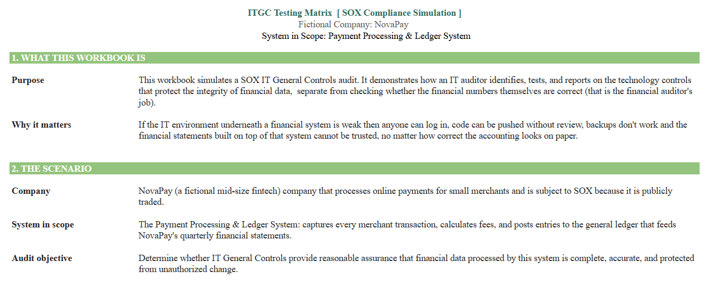

# ITGC Testing Matrix, SOX Compliance Simulation

I built this project to teach myself how IT auditors test IT General Controls (ITGCs) in a SOX compliance environment.

Instead of only reading about SOX and ITGCs, I created a simulated audit for a fictional fintech company, NovaPay. The goal was to understand how an auditor goes from a control statement to evidence, testing, findings, and recommendations.

## Workbook Preview

The workbook simulates testing across three areas:

- Access Management
- Change Management
- Data Operations

For each control, I documented the control objective, testing procedure, sample, evidence, test result, and any exceptions identified.

## Audit Results

The simulation contains 10 controls:

- 8 controls passed
- 2 controls failed
- 2 findings were documented

I intentionally included control failures so the project reflects the process of identifying and documenting exceptions.

## Areas Tested

### Access Management

Tests whether access to the financial system is properly granted, reviewed, and removed.

Examples:

- Manager approval before new access is granted
- Removal of access after employee termination
- Periodic review of privileged accounts

One control failed because a terminated employee retained system access beyond the required 24-hour period.

### Change Management

Tests whether changes to production systems follow appropriate review and approval procedures.

Examples:

- Code review before deployment
- Segregation of duties
- Review of emergency changes

One control failed because the same engineer committed and deployed a production change without the required independent separation of duties.

### Data Operations

Tests controls around financial data backups and system operations.

Examples:

- Daily backups
- Backup restoration testing
- Failed batch job monitoring
- Access to backup configuration

## Findings

### Finding 01, Terminated User Access

A terminated employee's access remained active beyond the required 24-hour period.

Risk: Medium

Recommendation:

Improve the HR-to-IT deprovisioning process and introduce automated notifications or workflow controls so termination events reach the appropriate IT team.

### Finding 02, Segregation of Duties

One engineer both committed and deployed a production change without the required independent separation of duties.

Risk: High

Recommendation:

Enforce separation of duties through the CI/CD process so production deployments require an independent reviewer or approver.

## What I Learned

The biggest thing I learned from this project was the difference between a control and a control test.

A company might state:

"Employee access is removed when the employee leaves."

An auditor needs evidence to determine whether the control actually operated as stated.

For example, the auditor might compare termination records with system access records and check whether access was removed within the required timeframe.

Building the testing procedures myself helped me understand this process better than simply reading about ITGCs.

## Tools and Concepts

- Microsoft Excel
- IT General Controls
- SOX compliance concepts
- Access Management
- Change Management
- Segregation of Duties
- Backup and Recovery Controls
- Audit Testing
- Risk and Control Assessment

## Project File

[ITGC_SOX_Testing_Matrix_NovaPay.xlsx](./ITGC_SOX_Testing_Matrix_NovaPay.xlsx)

The Excel workbook contains the complete simulated testing matrix, evidence references, test results, and findings summary.

## Disclaimer

This is a fictional educational project created to practice IT audit and ITGC testing concepts. NovaPay, its systems, users, evidence, and audit results are simulated.
